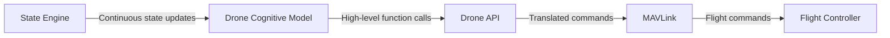

# Archived Concept: Drone Autonomy Stack

> Historical design exploration. For the current system boundaries and status,
> read [`../architecture/SOFTWARE-ARCHITECTURE.md`](../architecture/SOFTWARE-ARCHITECTURE.md).

## 1. Final Product

The final product is an autonomous drone platform with an onboard Drone Cognitive Model (DCM). The DCM receives human commands, interprets the mission, reasons about the drone's current state, and selects actions through the Drone API.

The system is designed so that the DCM does not communicate directly with the flight controller. Instead, it uses the Drone API as an abstraction layer. The Drone API converts high-level decisions into MAVLink operations, which are then sent to the flight controller.

The platform's primary hardware is:

- **Jetson Thor:** 128 GB RAM; runs the DCM, state processing, mission reasoning, and related onboard software.
- **Pixhawk 6X:** Runs the flight-controller software responsible for executing flight commands and controlling the aircraft.

The DCM is based on a **Qwen 30B-parameter LLM**. The final deployment configuration will need to account for model quantization, runtime overhead, context length, and the memory required for state updates and active missions.

## 2. System Architecture

The main command path is:

```text
DCM → Drone API → MAVLink → Flight Controller
```

The State Engine is a separate input to the DCM. It continuously provides the DCM with the current structured state of the drone.



The State Engine is not part of the command-execution chain. Its role is to keep the DCM informed so that the DCM can make decisions using the latest available state.

## 3. Hardware Architecture

### Jetson Thor

Jetson Thor is the onboard compute platform. It hosts the high-level autonomy software, including:

- The DCM language model
- Command interpretation
- Mission reasoning
- State Engine processing
- Drone API software
- Dataset and model experimentation components during development

The Jetson is responsible for deciding what the drone should do next, while the flight controller is responsible for executing flight behavior.

### Pixhawk 6X

Pixhawk 6X is the flight-control platform. It receives MAVLink commands and passes them to the flight-control software running on the controller.

Its role in this architecture is to execute flight operations and control the aircraft. It is downstream from the DCM and does not receive direct language-model output.

## 4. Software Components

### 4.1 Drone Cognitive Model (DCM)

The DCM is an onboard Qwen 30B-parameter LLM used as the drone's high-level decision-making system. It receives:

- Human commands
- Mission context
- State updates from the State Engine
- Results from previously requested Drone API functions

The DCM processes this information and decides which Drone API function should be called next.

Example decisions include:

- Calling `takeoff()` after receiving a takeoff command
- Calling `goto()` to move to a specified location
- Calling `orbit()` around a target
- Calling `return_home()` when the mission is complete
- Calling `land()` when the landing condition is met

The DCM produces decisions and API calls. It does not produce raw motor commands.

### 4.2 State Engine

The State Engine continuously collects and organizes the drone's current state into a format that the DCM can understand.

The State Engine may provide information such as:

- Current position
- Altitude
- Flight mode
- Battery state
- Mission progress
- Current action status
- Results of previous Drone API calls

Its output is a structured state update delivered to the DCM. The State Engine does not decide what action to take; it provides the information the DCM needs to make that decision.

### 4.3 Drone API

The Drone API is the controlled interface between the DCM and the aircraft systems.

Example functions include:

```text
takeoff()
land()
return_home()
goto(location)
orbit(target, radius)
get_state()
```

The DCM calls these functions instead of communicating directly with MAVLink or the flight controller. This keeps the DCM interface understandable and allows the underlying aircraft communication layer to change without changing the DCM's decision interface.

### 4.4 MAVLink Layer

The MAVLink layer translates Drone API operations into MAVLink messages understood by the flight controller.

For example:

```text
DCM decision: takeoff()
        ↓
Drone API: takeoff()
        ↓
MAVLink: takeoff command message
        ↓
Flight Controller: executes the command
```

MAVLink is therefore the communication layer between the Drone API and the flight controller.

### 4.5 Flight Controller

The flight controller receives MAVLink messages and executes the requested flight operations through the flight-control software running on the Pixhawk 6X.

The flight controller is the final software layer in the high-level autonomy command path.

## 5. End-to-End Operation

The system operates as a continuous decision loop:

1. A human gives the drone a command.
2. The DCM receives and interprets the command.
3. The State Engine provides the DCM with the current drone state.
4. The DCM selects a Drone API function.
5. The Drone API converts the selected function into a MAVLink operation.
6. MAVLink sends the operation to the flight controller.
7. The flight controller executes the operation.
8. The resulting state is sent back through the State Engine to the DCM.
9. The DCM decides whether another action is required.

The main execution path remains:

```text
DCM → Drone API → MAVLink → Flight Controller
```

The state feedback path is:

```text
Flight Controller and drone state → State Engine → DCM
```

## 6. Fine-Tuning Strategy

Fine-tuning should be treated as a staged process rather than a single training run. The DCM needs to learn several distinct capabilities:

1. Understand drone commands and mission intent.
2. Use the Drone API correctly.
3. Select actions based on the current state.
4. Continue multi-step missions and respond to action results.

These capabilities require several related datasets. The datasets can initially be generated from the simulator, with human or scripted review used to identify high-quality examples.

### 6.1 Dataset 1: Command and Mission-Intent Dataset

This dataset teaches the DCM how natural-language commands map to a structured mission or intended operation.

Example:

```text
User command: "Fly to the field and circle it twice."
Mission intent: inspect_area
Mission parameters: {location: "field", repetitions: 2}
```

The dataset should contain:

- Direct commands
- Paraphrases of the same command
- Commands containing mission parameters
- Multi-step mission descriptions
- Commands that require clarification or a change in mission state

This dataset can be created initially by writing seed commands and generating controlled paraphrases. It does not require simulator execution for every example because its purpose is to teach language and mission interpretation.

### 6.2 Dataset 2: Drone API Tool-Use Dataset

This dataset teaches the DCM how to translate an intended operation into a valid Drone API call.

Example:

```text
Mission intent: inspect_area
Parameters: {location: "field", repetitions: 2}
API call: orbit(target="field", repetitions=2)
```

The dataset should cover:

- Every supported Drone API function
- Correct function names
- Correct argument names and types
- Required and optional parameters
- Multiple valid ways to express the same operation
- API results returned after a function call

This dataset can be generated from the Drone API specification, hand-authored examples, and automatically generated parameter combinations. It should be validated against the real API schema before being used for training.

### 6.3 Dataset 3: State-to-Action Mission Trajectory Dataset

This is the central dataset for teaching the DCM to make drone-relevant decisions.

Each example represents one decision point in a simulated mission:

```text
Mission objective
Current structured state
Previous action and result
Available API functions
Expected next API call
Updated state
```

Example:

```json
{
  "mission": "Travel to the inspection area",
  "state": {
    "flight_mode": "airborne",
    "position": "launch_point",
    "battery": 82,
    "mission_stage": "transit"
  },
  "previous_result": "takeoff_complete",
  "target_action": {
    "function": "goto",
    "arguments": {"location": "inspection_area"}
  }
}
```

The collection process is:

1. Define a mission and initial simulator state.
2. Run the unfine-tuned Qwen 30B model through the Drone API.
3. Record every state, model response, API call, simulator result, and next state.
4. Score the resulting mission for completion, efficiency, and quality of decisions.
5. Keep successful trajectories and correct failed trajectories using a scripted policy, human review, or another reference policy.
6. Split the data by mission and environment so that related steps from the same episode do not leak into both training and evaluation sets.

Raw model rollouts should not automatically become training targets. A model can produce syntactically valid API calls that are strategically poor, so trajectory quality must be evaluated before examples are promoted into the desired-behavior dataset.

### 6.4 Dataset 4: Recovery and Preference Dataset

This dataset teaches the DCM how to choose between competing decisions and how to continue after an unsuccessful action.

It should contain examples such as:

- A successful trajectory compared with an inefficient trajectory
- A correct API call compared with an incorrect API call
- A useful recovery action after a failed function call
- A decision that completes a mission compared with one that causes the mission to stall

Each record can contain a preferred and rejected response:

```text
Current state and mission
Preferred DCM action
Rejected DCM action
Reason or simulator outcome
```

This dataset is optional for the first fine-tuning pass. It becomes useful after supervised fine-tuning, when the model already understands the API and can produce valid actions. It can support preference optimization or simulator-based reinforcement learning.

## 7. Dataset Collection and Training Process

The complete data and training workflow is:

```text
Drone API specification
        ↓
Command and API examples
        ↓
Simulator rollouts with the base Qwen 30B model
        ↓
Trajectory scoring and curation
        ↓
Supervised fine-tuning
        ↓
Recovery/preference data
        ↓
Preference optimization or simulator-based training
        ↓
Evaluation on unseen missions
```

The recommended first training pass is supervised fine-tuning using the command/intent, API tool-use, and curated state-to-action datasets. Recovery and preference optimization should follow only after the model can reliably use the Drone API.

Training is expected to use parameter-efficient fine-tuning, such as LoRA or QLoRA, rather than updating all 30B parameters. The Jetson Thor is the target onboard deployment platform; training may be performed on separate development hardware and the resulting model or adapter can then be deployed to the Jetson.

Evaluation should compare the original and fine-tuned models on held-out missions. Useful measurements include API-call validity, mission completion, number of actions, recovery quality, and inference latency.

## 8. Implementation Roadmap

### Phase 1: Develop the Drone API

Define and implement the high-level functions that the DCM will use to operate the drone. The API should provide a stable interface for actions and state requests.

Initial functions may include:

- `takeoff()`
- `land()`
- `return_home()`
- `goto()`
- `orbit()`
- `get_state()`

### Phase 2: Develop a Controllable Simulator Environment

Create a simulation environment in which the DCM can call the Drone API and observe the resulting state changes.

The simulator should support:

- Receiving Drone API calls
- Applying those actions to a simulated aircraft
- Returning updated state information
- Running repeatable missions
- Recording complete interaction trajectories

This environment will allow the API and DCM to be developed before connecting to physical hardware.

### Phase 3: Create and Curate the Datasets

Create the command/intent, API tool-use, and state-to-action trajectory datasets. Generate trajectory data by running the base model in the simulator, then score and curate the results. Create recovery and preference pairs from contrasting successful and unsuccessful trajectories.

### Phase 4: Fine-Tune and Evaluate the DCM

Begin with supervised fine-tuning using the curated datasets. Then evaluate the fine-tuned model on unseen simulation missions. If the model can use the API but still makes poor long-horizon choices, add the recovery/preference dataset and apply preference optimization or simulator-based reinforcement learning.

## 9. Architectural Principle

The system separates cognitive decision-making from aircraft control:

- **DCM:** Decides what the drone should do.
- **State Engine:** Tells the DCM what is currently happening.
- **Drone API:** Provides the DCM with an aircraft-control interface.
- **MAVLink:** Translates API operations into flight-controller messages.
- **Flight Controller:** Executes the resulting flight operations.

This separation allows the DCM, Drone API, simulator, and flight-controller integration to be developed and tested as distinct parts of the overall autonomy stack.
